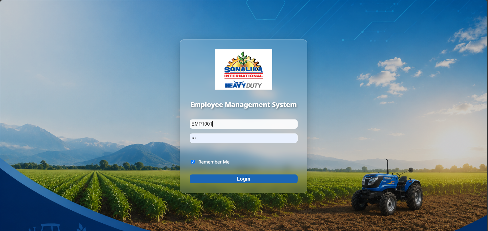
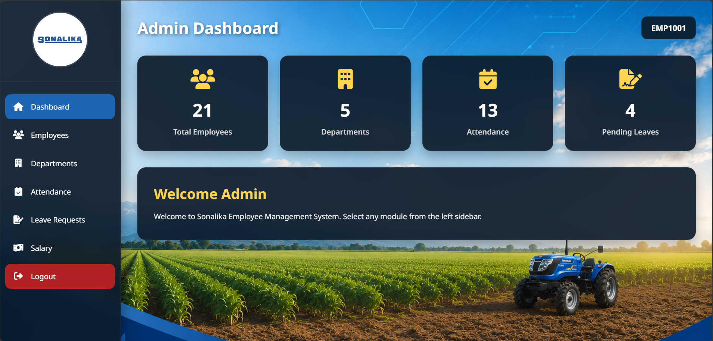

# &#x20;Employee Management System

A web-based Employee Management System developed using ASP.NET Core Web API, HTML, CSS, JavaScript, and Microsoft SQL Server.

The application provides an administrative interface for managing employee information and related operations, including departments, attendance, leave requests, and salary records.

## Features

- **Employee Login:** Employee code and password-based authentication.
- **Admin Dashboard:** Displays employee and department summaries, attendance, and pending leave information.
- **Employee Management:** Add, view, update, and delete employee records.
- **Department Management:** Manage department information.
- **Attendance Management:** Manage employee attendance records.
- **Leave Management:** Manage employee leave requests.
- **Salary Management:** Maintain employee salary information.
- **JWT Authentication:** Uses JSON Web Tokens for authenticated API requests.
- **Responsive Interface:** HTML and CSS-based frontend.

## Technologies Used

### Frontend

- HTML5
- CSS3
- JavaScript
- Font Awesome

### Backend

- C#
- ASP.NET Core Web API
- REST API
- JWT Authentication

### Database

- Microsoft SQL Server

### Development Tools

- Visual Studio
- SQL Server Management Studio
- Git
- GitHub

## Project Structure

```text
## Project Structure

```text
Employee-Management-System/
│
├── Controllers/
│   ├── AttendanceController.cs
│   ├── DashboardController.cs
│   ├── DepartmentController.cs
│   ├── EmployeeController.cs
│   ├── LeaveRequestController.cs
│   ├── LoginController.cs
│   └── SalaryController.cs
│
├── Data/
│   └── AppDbContext.cs
│
├── Models/
│   ├── Attendance.cs
│   ├── Dashboard.cs
│   ├── Department.cs
│   ├── Employee.cs
│   ├── EmployeeLogin.cs
│   ├── LeaveRequest.cs
│   ├── LoginRequest.cs
│   └── Salary.cs
│
├── Screenshots/
│   ├── loginpage.png
│   ├── dashboard.png
│   ├── Employeemangement.png
│   ├── departmentmangement.png
│   ├── Attendance Management.png
│   ├── Leave Management.png
│   └── Salary Management.png
│
|── ├── css/
│   ├── js/
│   └── [HTML files]
│
├── .gitignore
├── README.md
├── appsettings.json
├── Program.cs
├── SonalikaAPI.csproj
└── SonalikaAPI.http
```
```

## Application Workflow

1. The user opens the login page.
2. The user enters an employee code and password.
3. The frontend sends a login request to the ASP.NET Core API.
4. The backend validates the credentials.
5. After successful authentication, the API returns a JWT token.
6. The frontend stores the token and redirects the user to the dashboard.
7. The dashboard provides access to the available management modules.
8. The frontend communicates with the backend through API requests.

## Prerequisites

- Visual Studio with ASP.NET and web development support.
- .NET SDK compatible with the project.
- Microsoft SQL Server.
- SQL Server Management Studio.
- Git.
```
## Installation and Setup

### 1. Clone the Repository

```bash
git clone https://github.com/anubhav780/Sonalika-Employee-Management-System.git
```

Navigate to the project directory:

```bash
cd Sonalika-Employee-Management-System
```

### 2. Set Up the Database

1. Open SQL Server Management Studio.
2. Connect to your local SQL Server instance.
3. Create the database using the provided SQL scripts or Entity Framework Core migrations.
4. Configure your local database connection string.
5. Use fictional sample data for testing.

### 3. Configure the Backend

Open the backend project in Visual Studio.

Configure the database connection string and any required authentication settings using local configuration or environment variables.

Restore the required packages:

```bash
dotnet restore
```

Build the application:

```bash
dotnet build
```

### 4. Run the Backend

Navigate to the backend project directory and execute:

```bash
dotnet run
```

The API will start at the address configured in the project.

### 5. Run the Frontend

Open the frontend using the local development setup configured for the project.

Configure the frontend API base URL to match the address of the running backend.

If the frontend is hosted by ASP.NET Core, use the configured static-file hosting setup.


## API Modules

The application contains the following API controllers:

| Controller             | Responsibility           |
| ---------------------- | ------------------------ |
| AttendanceController   | Attendance operations    |
| DashboardController    | Dashboard data           |
| DepartmentController   | Department operations    |
| EmployeeController     | Employee operations      |
| LeaveRequestController | Leave request operations |
| LoginController        | User authentication      |
| SalaryController       | Salary operations        |

The exact API routes and HTTP methods are defined in the corresponding controllers.

## Database

The application uses Microsoft SQL Server for storing application data.

Database setup scripts are provided in the `database-Scripts` directory, if included.

Configure your own local database connection string before running the backend.

Do not use real employee records or production credentials when testing the application.

## Screenshots

### Login Page


### Dashboard



## Security

- Keep database credentials and authentication secrets out of the repository.
- Do not upload real employee records.
- Use HTTPS when deploying the application.
- Protect API endpoints that require authentication.
- Avoid storing sensitive information in browser storage.

## Future Enhancements

- Role-based authorization.
- Improved dashboard analytics.
- Employee search and pagination.
- Enhanced form validation.
- Automated testing.
- Cloud deployment.

## Author

**anubhav780**

GitHub: [https://github.com/](https://github.com/anubhav780)[anubhav780](https://github.com/anubhav780)

##
